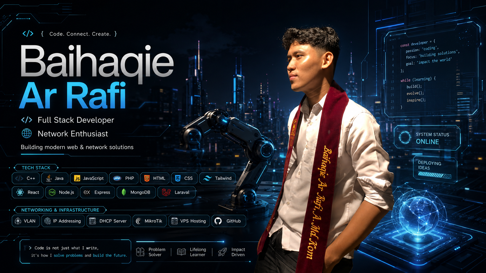

<div align="center">



# Hi, I'm Baihaqie Ar Rafi 👋

### Full Stack Developer | Network Enthusiast

<p>
  Saya adalah seorang developer yang tertarik pada pengembangan aplikasi web,
  backend development, database, server, dan jaringan komputer.
  Saya senang membangun solusi digital modern, mempelajari teknologi baru,
  serta mengembangkan kemampuan secara konsisten.
</p>

<p>
  <a href="mailto:baihaqiearrafi6@gmail.com">
    
  </a>
  <a href="https://instagram.com/bangpiii">
    
  </a>
  <a href="https://github.com/bangpii">
    
  </a>
</p>

</div>

---

## 👨‍💻 About Me

- 🔭 Saat ini fokus mengembangkan aplikasi berbasis web dan mobile.
- 🌱 Sedang memperdalam React, Node.js, Express.js, Laravel, dan sistem jaringan.
- 💻 Berpengalaman menggunakan PHP, JavaScript, Laravel, React, dan MySQL.
- 🌐 Memahami konfigurasi jaringan seperti VLAN, DHCP, IP addressing, dan MikroTik.
- 🖥️ Terbiasa melakukan deployment aplikasi menggunakan hosting dan VPS.
- 🚀 Tertarik membangun aplikasi yang modern, efisien, dan bermanfaat.
- 🤝 Terbuka untuk kolaborasi dalam pengembangan web, sistem informasi, dan jaringan.

---

## 🛠️ Tech Stack

### Programming Languages

<p>
  
</p>

### Frontend Development

<p>
  
</p>

### Backend Development

<p>
  
</p>

### Database

<p>
  
</p>

### Tools and Platforms

<p>
  
</p>

---

## 🌐 Networking and Infrastructure

Beberapa kemampuan saya dalam bidang jaringan dan infrastruktur:

- Konfigurasi LAN dan topologi jaringan
- VLAN dan switching
- IP addressing dan subnetting
- DHCP server
- MikroTik melalui Winbox
- Konfigurasi router
- Firewall dan hotspot
- Crimping kabel LAN
- Instalasi Windows dan Linux
- Konfigurasi server-client
- Deployment menggunakan shared hosting
- Deployment dan pengelolaan VPS
- Nginx dan Apache
- MySQL dan MariaDB

---

## 🚀 Featured Skills

```javascript
const baihaqie = {
  role: [
    "Full Stack Developer",
    "Network Enthusiast"
  ],

  frontend: [
    "HTML",
    "CSS",
    "Tailwind CSS",
    "JavaScript",
    "React"
  ],

  backend: [
    "PHP",
    "Laravel",
    "Node.js",
    "Express.js"
  ],

  database: [
    "MySQL",
    "MongoDB",
    "SQL",
    "Oracle"
  ],

  networking: [
    "LAN",
    "VLAN",
    "IP Addressing",
    "Subnetting",
    "DHCP Server",
    "MikroTik",
    "Router Configuration",
    "VPS Hosting"
  ],

  currentFocus: "Building modern web and network solutions"
};