<!-- Generated by GitHub Profile Agent Console. Edit profile.config.json, then run npm run generate. -->

  <picture>
    <source media="(max-width: 760px) and (prefers-color-scheme: dark)" srcset="./assets/hero/agent-console-b0b15b6f-mobile-dark.svg">
    <source media="(max-width: 760px)" srcset="./assets/hero/agent-console-b0b15b6f-mobile-light.svg">
    <source media="(prefers-color-scheme: dark)" srcset="./assets/hero/agent-console-b0b15b6f-dark.svg">
    <source media="(prefers-color-scheme: light)" srcset="./assets/hero/agent-console-b0b15b6f-light.svg">
    
  </picture>

  
  
  

  

## About Me

I build web applications end to end, from the interface the user touches to the API, database, and server behind it. Most of my work is product shaped: a real problem, a working application, and a deployment that stays up.

I work mostly with JavaScript and PHP, building interfaces in React and Tailwind, services in Node.js, Express, and Laravel, and shipping on shared hosting or a VPS.

I am based in Medan, Indonesia, where I study at Politeknik Negeri Medan and have interned with SAE DIGITAL Academy. I am open to collaboration on web development and information systems work.

## Current Focus

| Area | What I am exploring |
| --- | --- |
| **Full Stack Web Development** | End-to-end delivery: interface, API, database, and deployment for production-ready web applications. |
| **Frontend Engineering** | Responsive interfaces with React, Tailwind CSS, and Vite, built from reusable components. |
| **Backend and Database** | REST APIs and business logic with Node.js, Express, Laravel, MySQL, and MongoDB. |
| **Server and Deployment** | Linux servers, Nginx and Apache, and deploying to shared hosting or a VPS. |
| **Network Infrastructure** | Supporting skill: LAN topology, VLAN, subnetting, DHCP, MikroTik, firewall, and hotspot. |

## Featured Work

| Project | Focus | Why it matters |
| --- | --- | --- |
| [**Website Absensi**](https://github.com/bangpii/WebsiteAbsensi) | Attendance web application | A web-based attendance system that replaces manual paper logs with a searchable, role-scoped record. |
| [**MathDrive**](https://github.com/bangpii/mathdrive) | Math learning platform | An interactive platform for working through maths material, with progress tracked per learner. |
| [**DonasiYuk**](https://github.com/bangpii/donasiyuk) | Donation platform | A donation platform that makes campaigns browsable and contributions trackable end to end. |
| [**JasaHub**](https://github.com/bangpii/jasahub) | Freelance services hub | A marketplace-style hub connecting service providers with clients, from listings to request handling. |
| [**Londrex**](https://github.com/bangpii/Lodrex) | Laundry service management | A laundry service web app with public price lists, customer and service management, order tracking with receipt generation, and admin statistics. |
| [**BangPii Wisata**](https://github.com/bangpii/Wisata) | Travel guide platform | A travel platform for publishing destination guides, photos, and practical visitor information. |

## Project Gallery

<table>
<tr>
<td width="50%" valign="top">
  
   
  <a href="https://adminabsensismkn1duakoto.lmssekolah.com" target="_blank" rel="noopener noreferrer"><b>Website Absensi</b></a> &mdash; Attendance web application
</td>
<td width="50%" valign="top">
  
   
  <a href="https://math-drive-tawny.vercel.app" target="_blank" rel="noopener noreferrer"><b>MathDrive</b></a> &mdash; Math learning platform
</td>
</tr>
<tr>
<td width="50%" valign="top">
  
   
  <a href="https://donasi-yuk.vercel.app" target="_blank" rel="noopener noreferrer"><b>DonasiYuk</b></a> &mdash; Donation platform
</td>
<td width="50%" valign="top">
  
   
  <a href="https://jasa-hub-tau.vercel.app" target="_blank" rel="noopener noreferrer"><b>JasaHub</b></a> &mdash; Freelance services hub
</td>
</tr>
<tr>
<td width="50%" valign="top">
  
   
  <b>Londrex</b> &mdash; Web application project
</td>
<td width="50%" valign="top">
  
   
  <a href="https://wisata-smoky.vercel.app" target="_blank" rel="noopener noreferrer"><b>BangPii Wisata</b></a> &mdash; Travel guide platform
</td>
</tr>
<tr>
<td width="50%" valign="top">
  
   
  <a href="https://bang-pii-news.vercel.app" target="_blank" rel="noopener noreferrer"><b>BangPii News</b></a> &mdash; News portal
</td>
<td width="50%" valign="top">
  
   
  <a href="https://raharpa-shopp.vercel.app" target="_blank" rel="noopener noreferrer"><b>Thrift Online</b></a> &mdash; Online storefront
</td>
</tr>
<tr>
<td width="50%" valign="top">
  
   
  <a href="https://pernikahan-three.vercel.app" target="_blank" rel="noopener noreferrer"><b>Pernikahan</b></a> &mdash; Wedding event platform
</td>
<td width="50%" valign="top">
  
   
  <b>Futsal Terminal</b> &mdash; Futsal match terminal
</td>
</tr>
<tr>
<td width="50%" valign="top">
  
   
  <a href="https://bangpii-pdf.vercel.app" target="_blank" rel="noopener noreferrer"><b>BangPii PDF</b></a> &mdash; PDF utility tool
</td>
<td width="50%" valign="top">
  
   
  <a href="https://bangpii-cerita.vercel.app" target="_blank" rel="noopener noreferrer"><b>BangPii Cerita</b></a> &mdash; Story platform
</td>
</tr>
<tr>
<td width="50%" valign="top">
  
   
  <a href="https://react-vault-sigma.vercel.app" target="_blank" rel="noopener noreferrer"><b>React Dokumentasi</b></a> &mdash; React documentation site
</td>
<td width="50%" valign="top">
  
   
  <a href="https://make-over-one.vercel.app" target="_blank" rel="noopener noreferrer"><b>MakeOver</b></a> &mdash; Web application project
</td>
</tr>
</table>

## How I Build

I care about the whole path a request takes. On the front, a responsive interface that stays fast and readable on a phone. In the middle, a clean API and a database schema that will not fight me six months later. On the back, a server that can be deployed and debugged without drama. I also set up the network these applications run on, so I can trace a problem end to end instead of guessing where it lives.

### What I Work With

- Full stack web application development
- Responsive frontend with React and Tailwind CSS
- REST API development with Express and Laravel
- Database design with MySQL, PostgreSQL, and MongoDB
- Authentication, roles, and session handling
- Third-party API and payment integration
- Responsive and mobile-first UI implementation
- Git workflow and code review collaboration
- Debugging and fixing defects across the stack
- Deployment to shared hosting and VPS

### Infrastructure and Network

Supporting skills for the servers and networks these applications run on:

- Linux server installation and administration
- Nginx and Apache web server configuration
- MySQL and MariaDB administration
- LAN topology and structured cabling
- VLAN segmentation and switching
- IP addressing, subnetting, and DHCP server
- MikroTik configuration through Winbox
- Router, firewall, and hotspot setup

## Tech Stack

`JavaScript` · `TypeScript` · `React` · `Tailwind CSS` · `Vite` · `Node.js` · `Express.js` · `PHP` · `Laravel` · `MySQL` · `MongoDB` · `PostgreSQL` · `HTML5` · `CSS3` · `Git` · `Docker` · `Linux` · `MikroTik`

### Languages

### Frontend

### Backend

### Database

### Infrastructure

---

  
  

---

## Contribution Snake

  <picture>
    <source media="(prefers-color-scheme: dark)" srcset="./assets/snake/snake-dark.svg">
    <source media="(prefers-color-scheme: light)" srcset="./assets/snake/snake-light.svg">
    
  </picture>

---

  Building web systems and the networks that carry them.

