<!-- Generated by GitHub Profile Agent Console. Edit profile.config.json, then run npm run generate. -->

  <picture>
    <source media="(max-width: 760px) and (prefers-color-scheme: dark)" srcset="./assets/hero/agent-console-967a5c84-mobile-dark.svg">
    <source media="(max-width: 760px)" srcset="./assets/hero/agent-console-967a5c84-mobile-light.svg">
    <source media="(prefers-color-scheme: dark)" srcset="./assets/hero/agent-console-967a5c84-dark.svg">
    <source media="(prefers-color-scheme: light)" srcset="./assets/hero/agent-console-967a5c84-light.svg">
    
  </picture>

  
  
  

## About Me

I build web applications end to end, and I maintain the network infrastructure they run on. My work spans frontend interfaces, backend services, databases, and the Linux servers and LAN configuration underneath them.

I am based in Medan, Indonesia, where I study at Politeknik Negeri Medan and have interned with SAE DIGITAL Academy.

I am open to collaboration on web development, information systems, and network infrastructure work.

## Current Focus

| Area | What I am exploring |
| --- | --- |
| **Full Stack Web Development** | End-to-end delivery: interface, API, database, and deployment for production-ready web applications. |
| **Frontend Engineering** | Responsive interfaces with React, Tailwind CSS, and Vite, built from reusable components. |
| **Backend and Database** | REST APIs and business logic with Node.js, Express, Laravel, and relational or document databases. |
| **Network Infrastructure** | LAN topology, VLAN and switching, subnetting, DHCP, MikroTik, firewall, and hotspot configuration. |
| **Server and Deployment** | Linux server administration, Nginx and Apache, VPS and shared hosting deployment, and database operations. |

## Featured Work

| Project | Focus | Why it matters |
| --- | --- | --- |
| [**Website Absensi**](https://github.com/bangpii/website-absensi) | Attendance web application | A web-based attendance system that replaces manual paper logs with a searchable, role-scoped record. |
| [**MathDrive**](https://github.com/bangpii/mathdrive) | Math learning platform | An interactive platform for working through maths material, with progress tracked per learner. |
| [**DonasiYuk**](https://github.com/bangpii/donasiyuk) | Donation platform | A donation platform that makes campaigns browsable and contributions trackable end to end. |
| [**JasaHub**](https://github.com/bangpii/jasahub) | Freelance services hub | A marketplace-style hub connecting service providers with clients, from listings to request handling. |
| [**Londrex**](https://github.com/bangpii/londrex) | Web application project | A full stack web project. Description pending. |
| [**BangPii Wisata**](https://github.com/bangpii/bangpii-wisata) | Travel guide platform | A travel platform for publishing destination guides, photos, and practical visitor information. |

## Project Gallery

<table>
<tr>
<td width="50%" valign="top">
  <a href="https://adminabsensismkn1duakoto.lmssekolah.com" target="_blank" rel="noopener noreferrer">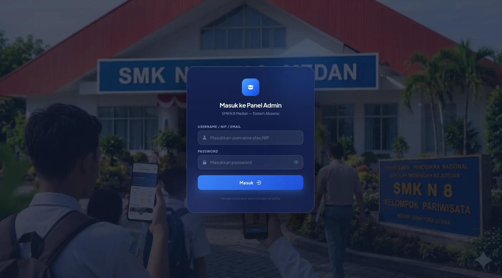</a>
   
  <a href="https://adminabsensismkn1duakoto.lmssekolah.com" target="_blank" rel="noopener noreferrer"><b>Website Absensi</b></a> &mdash; Attendance web application
</td>
<td width="50%" valign="top">
  <a href="https://math-drive-tawny.vercel.app" target="_blank" rel="noopener noreferrer">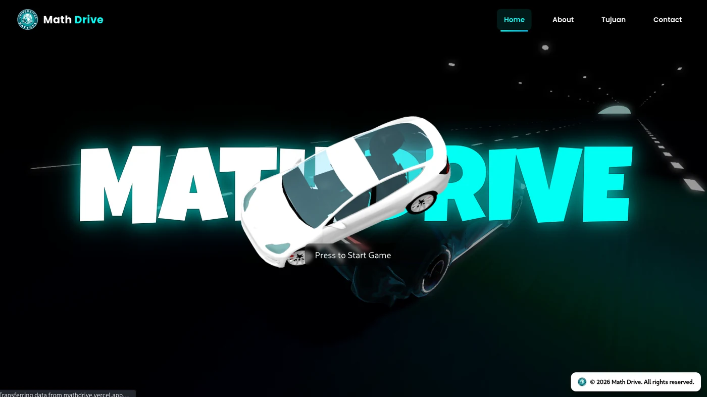</a>
   
  <a href="https://math-drive-tawny.vercel.app" target="_blank" rel="noopener noreferrer"><b>MathDrive</b></a> &mdash; Math learning platform
</td>
</tr>
<tr>
<td width="50%" valign="top">
  <a href="https://donasi-yuk.vercel.app" target="_blank" rel="noopener noreferrer">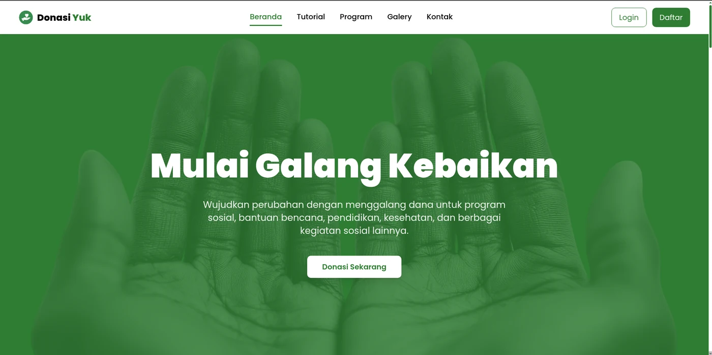</a>
   
  <a href="https://donasi-yuk.vercel.app" target="_blank" rel="noopener noreferrer"><b>DonasiYuk</b></a> &mdash; Donation platform
</td>
<td width="50%" valign="top">
  <a href="https://jasa-hub-tau.vercel.app" target="_blank" rel="noopener noreferrer">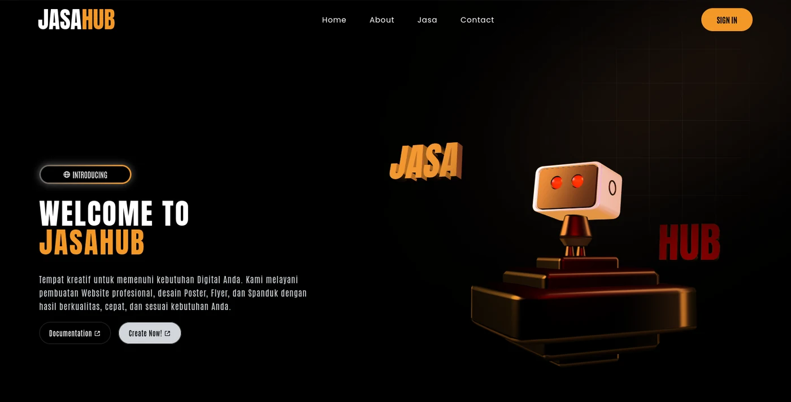</a>
   
  <a href="https://jasa-hub-tau.vercel.app" target="_blank" rel="noopener noreferrer"><b>JasaHub</b></a> &mdash; Freelance services hub
</td>
</tr>
<tr>
<td width="50%" valign="top">
  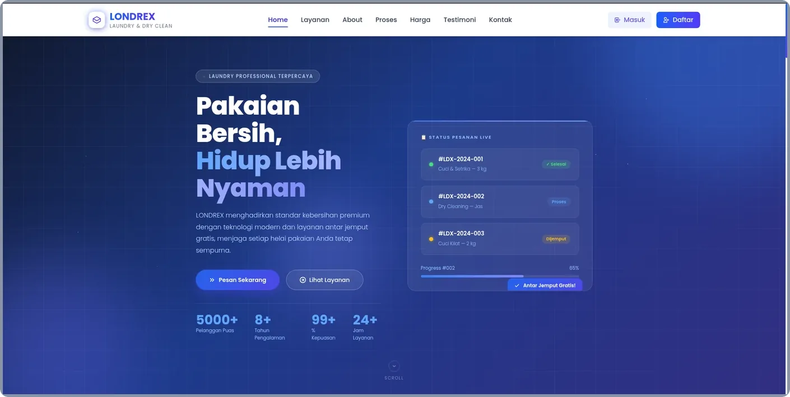
   
  <b>Londrex</b> &mdash; Web application project
</td>
<td width="50%" valign="top">
  <a href="https://wisata-smoky.vercel.app" target="_blank" rel="noopener noreferrer">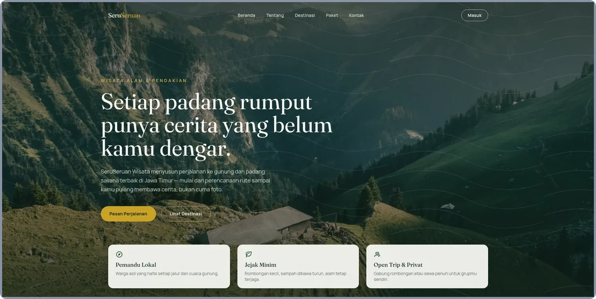</a>
   
  <a href="https://wisata-smoky.vercel.app" target="_blank" rel="noopener noreferrer"><b>BangPii Wisata</b></a> &mdash; Travel guide platform
</td>
</tr>
<tr>
<td width="50%" valign="top">
  <a href="https://bang-pii-news.vercel.app" target="_blank" rel="noopener noreferrer">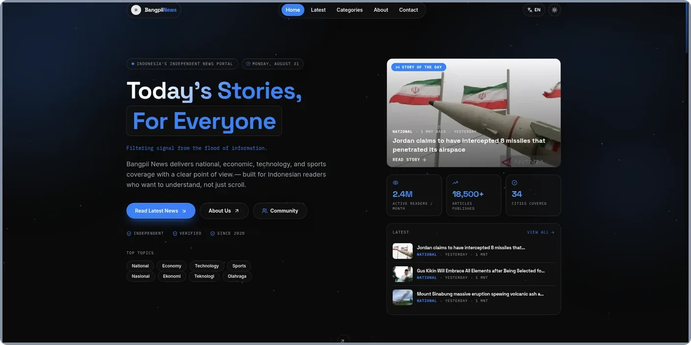</a>
   
  <a href="https://bang-pii-news.vercel.app" target="_blank" rel="noopener noreferrer"><b>BangPii News</b></a> &mdash; News portal
</td>
<td width="50%" valign="top">
  <a href="https://raharpa-shopp.vercel.app" target="_blank" rel="noopener noreferrer">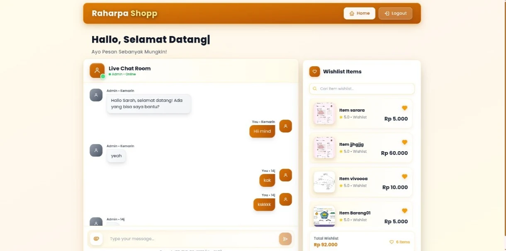</a>
   
  <a href="https://raharpa-shopp.vercel.app" target="_blank" rel="noopener noreferrer"><b>Thrift Online</b></a> &mdash; Online storefront
</td>
</tr>
<tr>
<td width="50%" valign="top">
  <a href="https://pernikahan-three.vercel.app" target="_blank" rel="noopener noreferrer">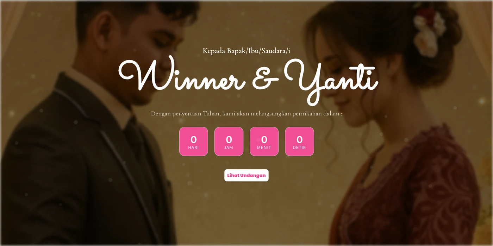</a>
   
  <a href="https://pernikahan-three.vercel.app" target="_blank" rel="noopener noreferrer"><b>Pernikahan</b></a> &mdash; Wedding event platform
</td>
<td width="50%" valign="top">
  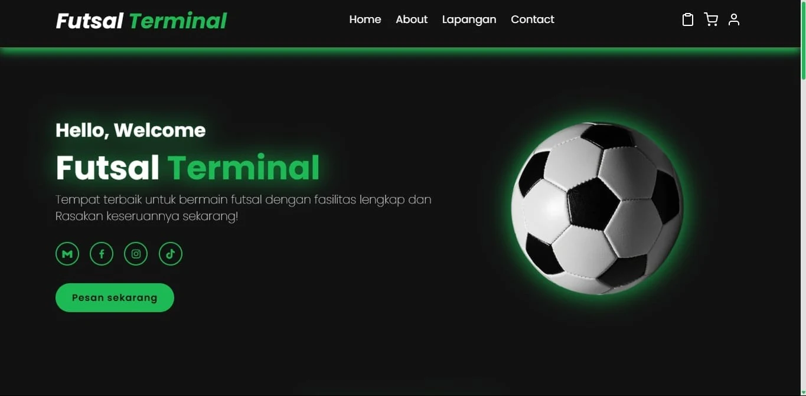
   
  <b>Futsal Terminal</b> &mdash; Futsal match terminal
</td>
</tr>
<tr>
<td width="50%" valign="top">
  <a href="https://bangpii-pdf.vercel.app" target="_blank" rel="noopener noreferrer">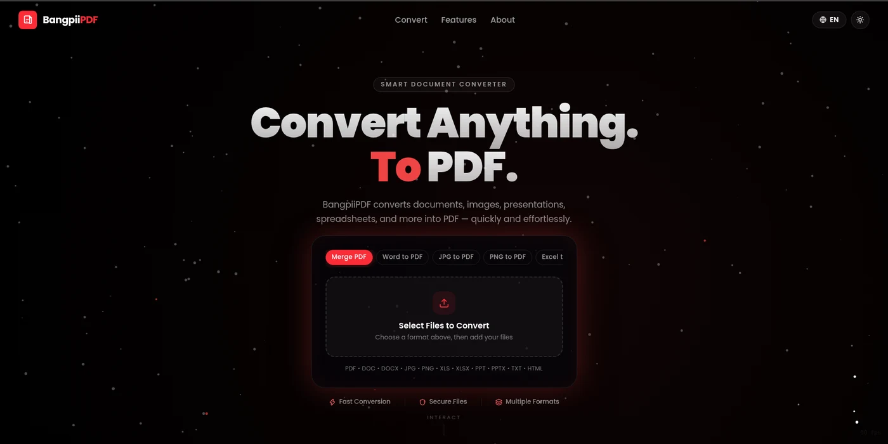</a>
   
  <a href="https://bangpii-pdf.vercel.app" target="_blank" rel="noopener noreferrer"><b>BangPii PDF</b></a> &mdash; PDF utility tool
</td>
<td width="50%" valign="top">
  <a href="https://bangpii-cerita.vercel.app" target="_blank" rel="noopener noreferrer">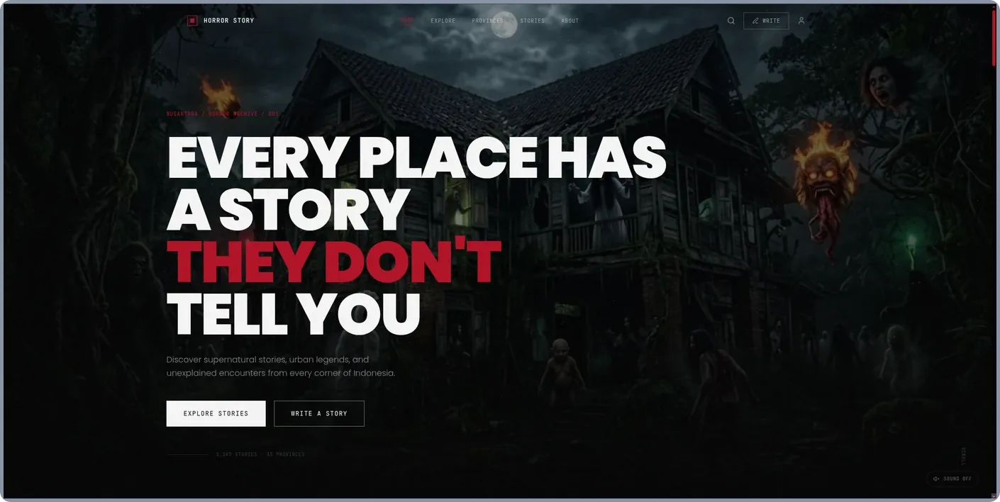</a>
   
  <a href="https://bangpii-cerita.vercel.app" target="_blank" rel="noopener noreferrer"><b>BangPii Cerita</b></a> &mdash; Story platform
</td>
</tr>
<tr>
<td width="50%" valign="top">
  <a href="https://react-vault-sigma.vercel.app" target="_blank" rel="noopener noreferrer">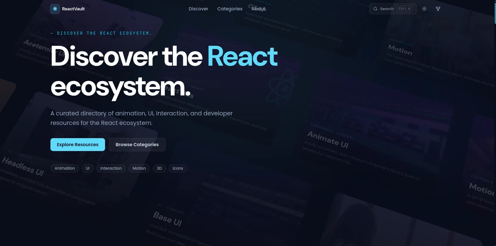</a>
   
  <a href="https://react-vault-sigma.vercel.app" target="_blank" rel="noopener noreferrer"><b>React Dokumentasi</b></a> &mdash; React documentation site
</td>
<td width="50%" valign="top">
  <a href="https://make-over-one.vercel.app" target="_blank" rel="noopener noreferrer">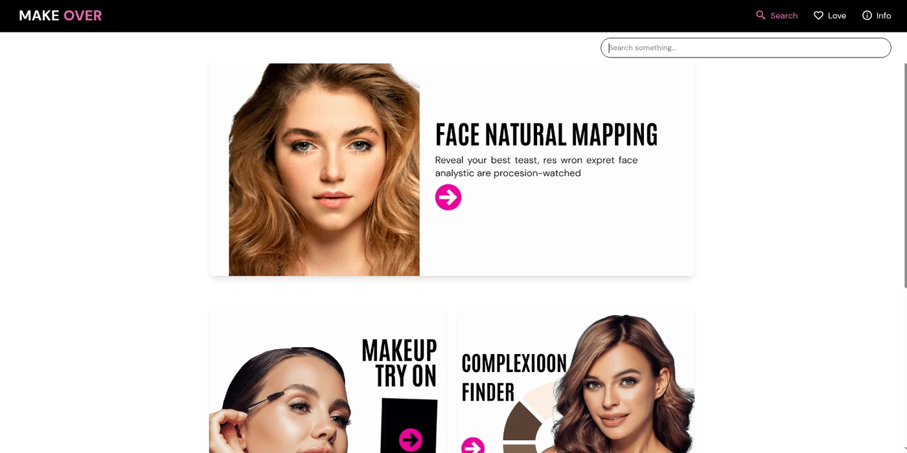</a>
   
  <a href="https://make-over-one.vercel.app" target="_blank" rel="noopener noreferrer"><b>MakeOver</b></a> &mdash; Web application project
</td>
</tr>
</table>

## Networking and Infrastructure

Most web systems are only as reliable as the network that carries them. I work on both sides of that boundary: building the application with PHP, Laravel, React, and Node.js, and keeping the server, routing, and LAN behind it running. That includes VLAN segmentation, DHCP and IP address planning, MikroTik configuration, and deploying to shared hosting or a VPS with Nginx in front.

### Capabilities

- LAN design and physical network topology
- VLAN segmentation and switch configuration
- IP addressing, subnetting, and DHCP server
- MikroTik configuration through Winbox
- Router, firewall, and hotspot setup
- LAN cable crimping and structured cabling
- Windows and Linux installation
- Client and server configuration
- VPS deployment and server management
- Shared hosting deployment
- Nginx and Apache web server configuration
- MySQL and MariaDB administration

## Tech Stack

`JavaScript` · `TypeScript` · `React` · `Tailwind CSS` · `Vite` · `Node.js` · `Express.js` · `PHP` · `Laravel` · `MySQL` · `MongoDB` · `PostgreSQL` · `HTML5` · `CSS3` · `Git` · `Docker` · `Linux` · `MikroTik`

### Languages

### Frontend

### Backend

### Database

### Infrastructure

---

  
  

  

---

  Building web systems and the networks that carry them.

